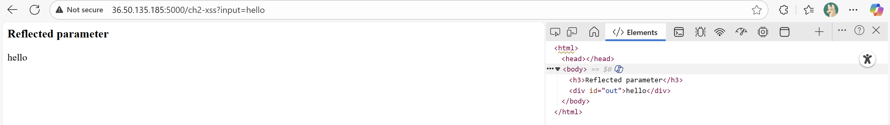
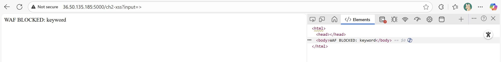
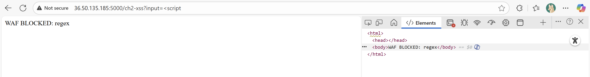
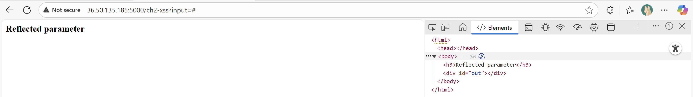
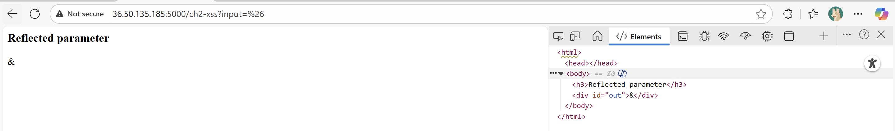
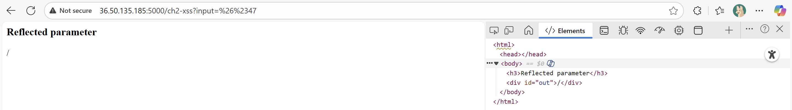
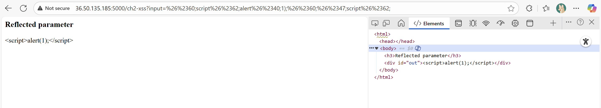
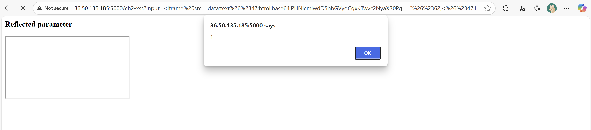

# Challenge 2: Reflected XSS

## Tóm tắt

Trang web được sử dụng cơ chế bảo vệ WAF. Mục tiêu là thực thi đoạn mã JavaScript alert(1) trên trình duyệt của nạn nhân, trong khi vượt qua các bộ lọc (WAF - Web Application Firewall). Challenge chấp nhận truy vấn với tham số: `?input=<câu truy vấn>`

## Thực hiện tấn công

### Bước 1: Kiểm tra các ký tự, cú pháp bị chặn

Truy vấn thử nghiệm đơn giản với `hello`. Kết quả là hiển thị giá trị tham số truy vấn trên giao diện với thẻ `div`.



Truy vấn với các ký tự `<` `>` `/` `;` `'` `.`. Kết quả cho thấy các ký tự `>` `/` bị WAF blocked từ khoá.



Tương tự với các từ khoá:
    `script`: không bị chặn.
    `alert`: không bị chặn.
    `onerror`: bị chặn từ khoá.
    `data`: không bị chặn.
    `<script`: bị WAF blocked regex (regular expression).
    `alert()`: bị chặn từ khoá.



Các ký tự `&` `#` `+` không bị chặn nhưng không hiển thị.



### Bước 2: Bypass các từ khoá bị chặn

Các ký tự bị xoá `&` `#` `+` : thông qua bằng URL encoding.



Các ký tự bị chặn `>` `/` : thông qua bằng HTML number với phần `&#` đổi thành dạng URL encoding là `%26%23`. Các ký tự thay đổi ký tự chữ cái tương tự ký tự dấu.



### Bước 3: Thực hiện viết truy vấn tấn công

Sử dụng truy vấn: `<script>alert(1);</script>` dưới dạng:
```%26%2360;script%26%2362;alert%26%2340;1);%26%2360;%26%2347;script%26%2362;```
Kết quả câu lệnh được in ra trên màn hình như văn bản (bypass không thành công).



Sử dụng thẻ html: ``. Truy vấn như sau: `<iframe src="data:text/html;base64,PHNjcmlwdD5hbGVydCgxKTwvc2NyaXB0Pg=="></iframe>` dưới dạng: ```%3Ciframe%20src=%22data:text%26%2347;html;base64,PHNjcmlwdD5hbGVydCgxKTwvc2NyaXB0Pg==%22%26%2362;%3C%26%2347;iframe%26%2362;```

    - `data:` : Báo hiệu đây là dữ liệu nhúng.

    - `text/html` : Chỉ định loại dữ liệu là HTML (trình duyệt sẽ xử lý nó như một trang HTML).

    - `base64,` : Báo hiệu dữ liệu được mã hóa bằng `Base64`.

    - `PHNjcmlwdD5hbGVydCgxKTwvc2NyaXB0Pg==` : Đây là nội dung đã bị mã hóa.
        - Đoạn mã gốc: `<script>alert(1)</script>`.

    - Trình duyệt tạo ra một `iframe` (một khung nội tuyến, về cơ bản là một trang web nhỏ bên trong trang web chính). Nội dung của iframe này chính là đoạn mã đã được mã hoá `base64`.

Kết quả của truy vấn là tấn công XSS bypass được WAF.



##  Tài liệu tham khảo

<a href="http://36.50.135.185:5000/ch2-xss">Challenge 2 - Reflected XSS 

